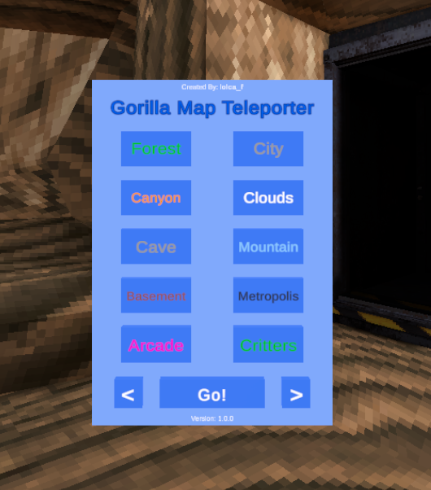

# GorillaMapTeleporter-GT
A BepInEx mod for Gorilla Tag that lets you quickly teleport to any map you want!\
The mod only works in no lobby or a private modded lobby to make it legal

## How To Use
Open the menu with your right primary (A)\
Select the map you want to teleport to\
Click "Go!" to teleport to the selected map\
To change the current page click the arrows on the bottom of the menu (Only 2 Pages)
## Features

  
<b>All Teleportable Locations</b>

    

      Forest 
      City 
      Canyons 
      Clouds 
      Caves 
      Mountain 
      Basement 
      Metropolis 
      Arcade 
      Critters 
      Skate Park 
      Monke Blocks 
      Ghost Reactor 
      Lava Forest 
      Space 
      Share My Blocks 
      Magmarena (RIP) 
    

  

## Dependencies
This mod depends on [Utilla](https://github.com/sirkingbinx/Utilla/releases) (You can also download with [MMM](https://github.com/NgbatzYT/MonkeModManager))
## Disclaimer
This product is not affiliated with Another Axiom Inc. or its videogames Gorilla Tag and Orion Drift and is not endorsed or otherwise sponsored by Another Axiom. Portions of the materials contained herein are property of Another Axiom. ©2021 Another Axiom Inc.
